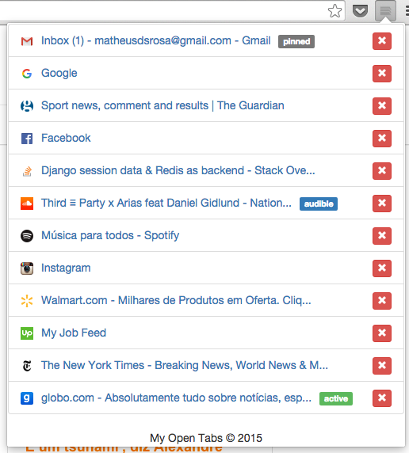

# My Open Tabs
This Google Chrome Extension displays a list of open tabs in the current window.

## Screenshot

## Installation
###### Remember to check the `Developer mode` checkbox.

1. Clone repository `git clone https://github.com/mdsrosa/my-open-tabs.git`.
2. Open a new tab in Google Chrome.
3. Go to chrome://extensions.
4. Click `Load unpacked extension` button.
5. Go to `my-open-tabs` folder.
6. Click `Select` button.

## Keyboard Shortcut

1. Open a new tab in Google Chrome.
2. Go to chrome://extensions.
3. Click `Keyboard shortcuts` link.
4. Define a shortcut for "My Open Tabs".
6. Click `Ok` button.

## License
See the [LICENSE](LICENSE.md) file for license rights and limitations (MIT).
